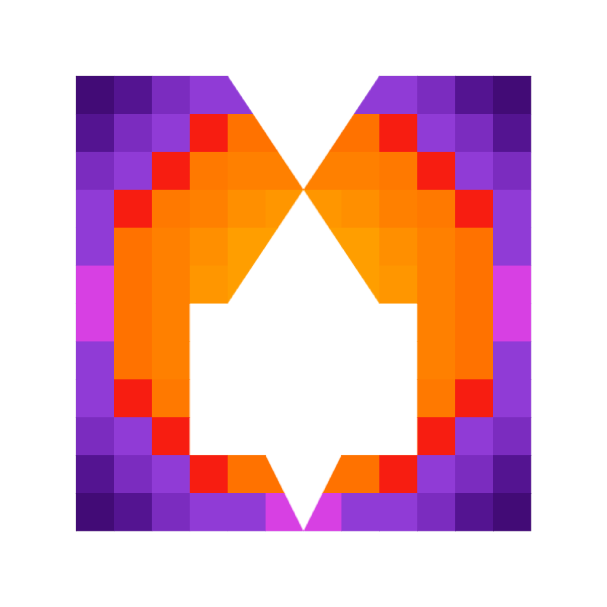
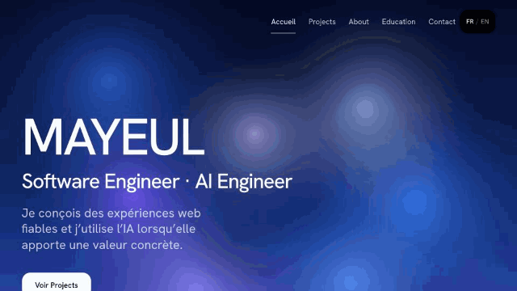

<div align="center">

  

  <h1>Mayeul</h1>

  <p>
    <strong>Software Engineer · AI Engineer</strong>
  </p>

  <p>
    A minimalist, kinetic, and editorial web portfolio built with TanStack Start, React 19, Nitro on Bun, and Tailwind CSS v4.
  </p>

  <p>
    <a href="https://github.com/Acrazie/portfolio-web/actions/workflows/ci.yml"></a>
    <a href="https://github.com/Acrazie/portfolio-web/releases"></a>
    <a href="https://bun.sh"></a>
    <a href="https://react.dev"></a>
    <a href="https://tanstack.com/start"></a>
    <a href="https://tailwindcss.com"></a>
    <a href="https://biomejs.dev"></a>
    <a href="https://inlang.com/m/gerre34r/library-inlang-paraglideJs"></a>
  </p>

  <p>
    <a href="#quick-start">Quick Start</a>
    <span> · </span>
    <a href="#tech-stack">Tech Stack</a>
    <span> · </span>
    <a href="#documentation">Documentation</a>
  </p>

  <br />

  

</div>

<br />

---

## Quick Start

### Prerequisites

- [Bun](https://bun.sh) (v1.3.14+)

### Run Locally

```bash
# 1. Clone the repository
git clone git@github.com:Acrazie/portfolio-web.git
cd portfolio-web

# 2. Install dependencies
bun install --frozen-lockfile

# 3. Start local development server
bun run dev
```

Open [http://127.0.0.1:3000](http://127.0.0.1:3000) in your browser.

---

## Tech Stack

| Domain | Technologies |
| :--- | :--- |
| **Framework & SSR** | [TanStack Start](https://tanstack.com/start) with [React 19](https://react.dev) |
| **Runtime & Server** | [Bun](https://bun.sh) with [Nitro](https://nitro.build) (bun preset) |
| **Styling & Tokens** | [Tailwind CSS v4](https://tailwindcss.com) with custom editorial design tokens |
| **Internationalization** | [Paraglide JS](https://inlang.com/m/gerre34r/library-inlang-paraglideJs) (bilingual French & English, French default) |
| **Linting & Code Quality** | [Biome](https://biomejs.dev) & TypeScript strict mode |
| **Testing** | [Vitest](https://vitest.dev) (Unit tests) & [Playwright](https://playwright.dev) (E2E browser tests) |
| **Git Hooks & Releases** | [Lefthook](https://github.com/evilmartians/lefthook), [Release Please](https://github.com/googleapis/release-please), [git-cliff](https://git-cliff.org) |
| **Delivery & Hosting** | Docker, [Dokploy](https://dokploy.com) CD on VPS, Cloudflare Tunnel, Telegram alerts |

---

## Documentation

Detailed specifications and architectural guides are available in the repository:

- [`AGENTS.md`](./AGENTS.md) — Authoritative development rules, package manager standards, and Git conventions for AI agents.
- [`DESIGN.md`](./DESIGN.md) — Complete design system tokens, typography scales, and editorial layout standards.
- [`PRODUCT.md`](./PRODUCT.md) — Ground truth on product scope, positioning, confirmed background facts, and external profiles.
- [`CHANGELOG.md`](./CHANGELOG.md) — Automated changelog generated by Release Please and git-cliff.
